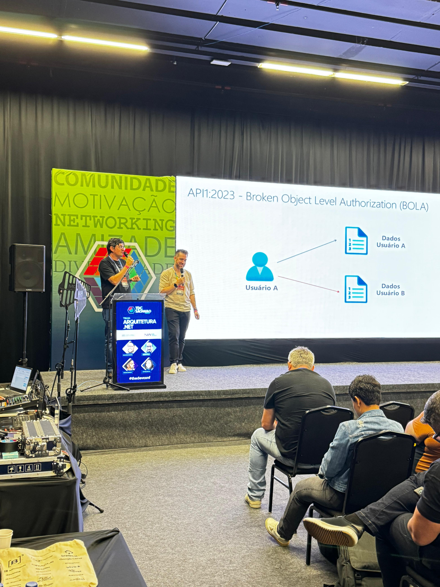
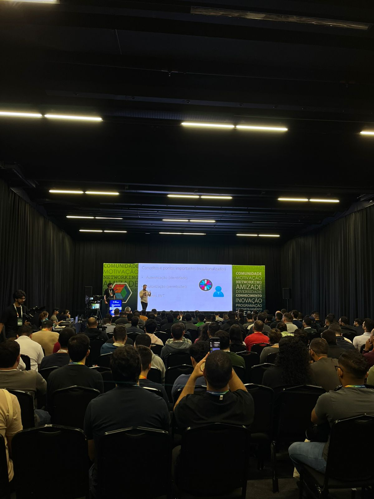
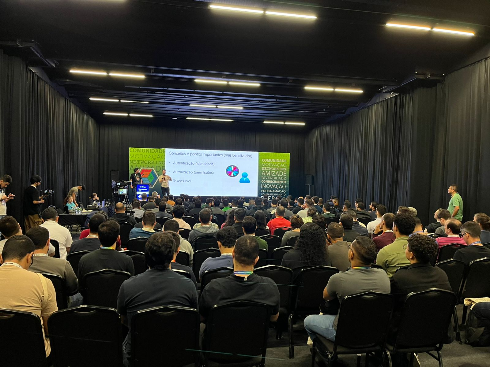
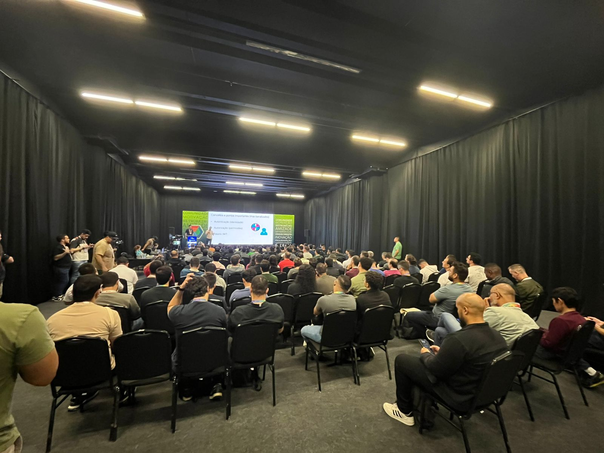
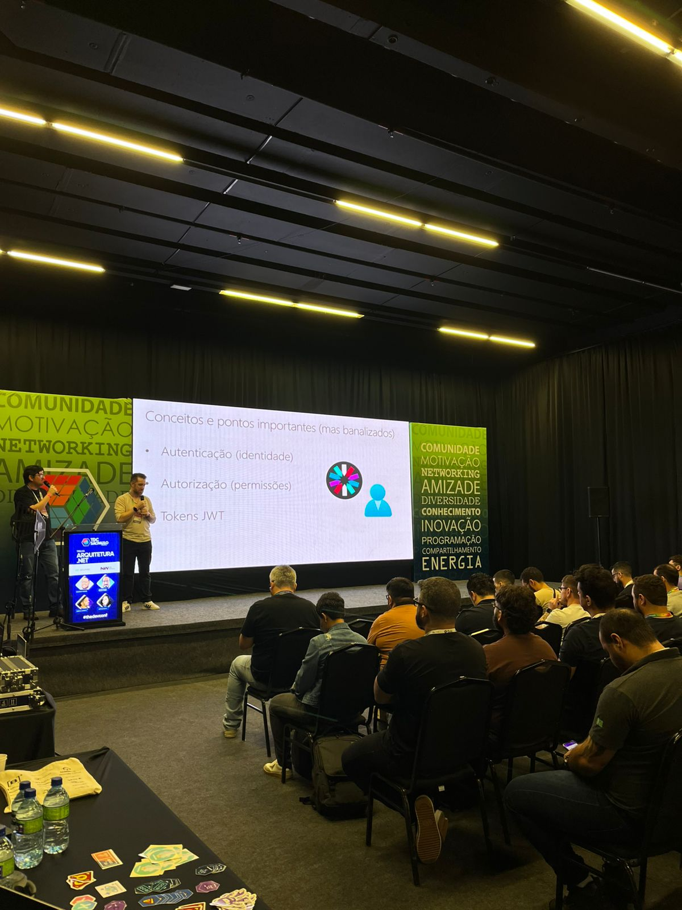

# OWASP-ApiTop10-Vulnerabilites_TDC-SP-2024
Materiais de apresentação sobre OWASP API Security Top 10 realizada no dia 19/09/2024, durante o TDC São Paulo.

---

Título da apresentação: **OWASP e desenvolvimento de APIs em .NET - 10 recomendações para tornar suas APIs mais seguras**

Evento: **TDC Summit São Paulo 2024**

Data: **19/09/2024 (quinta-feira)**

Tecnologias e tópicos abordados: **.NET, ASP.NET Core, OWASP API Security Top 10, JWT, Cybersecurity, API Gateways, Rate Limit, Resiliência, Azure API Management, Microsoft Entra ID...**

Número de participantes: **160 pessoas (estimativa, presencial + online)**

Site do evento: **https://thedevconf.com/tdc/2024/sao-paulo/trilha-arquitetura-net**

Local: **PRO MAGNO Centro de Eventos - Avenida Professora Ida Kolb, 513 - Jardim das Laranjeiras - São Paulo-SP - CEP: 02518-000**

Deixo aqui meus agradecimentos ao **Jhonathan de Souza Soares (Microsoft MVP)**, ao **Vinicius Clímaco (Microsoft MVP)**, à **Letticia Nicoli (Microsoft MVP)** e ao **Fernando Mendes (Microsoft MVP Alumni)** demais organizadores por todo o apoio para que eu partipasse como palestrante de mais uma edição do **TDC**.

---

