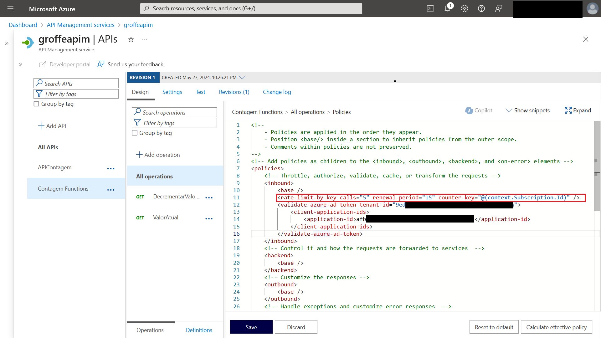

# APIM-RateLimit-SubscriptionKey
Exemplo com configuracões para definir um Rate Limit por Subscription Key para o Azure API Management.

Exemplo de uso da policy **&lt;rate-limit-by-key>** (**inbound**):

```xml
<policies>
    <inbound>
        <base />
        <rate-limit-by-key calls="5" renewal-period="15" counter-key="@(context.Subscription.Id)" />
    </inbound>
    <backend>
        <base />
    </backend>
    <outbound>
        <base />
    </outbound>
    <on-error>
        <base />
    </on-error>
</policies>
```



Para saber mais sobre a policy **&lt;rate-limit-by-key>** acesse:

**https://learn.microsoft.com/en-us/azure/api-management/rate-limit-by-key-policy**